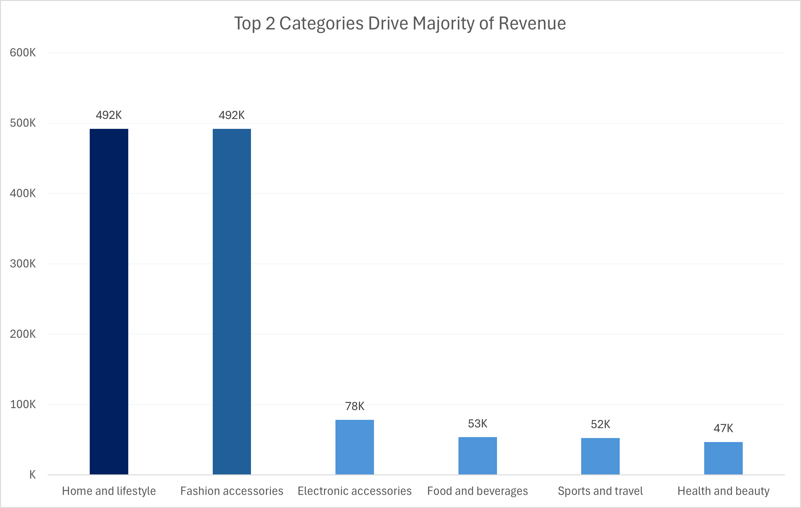

# 🛒 Walmart Retail Sales Analysis (SQL + Python)

## 📊 Revenue Insight Visualization



📌 Insight: The top 2 categories (Home & Lifestyle and Fashion Accessories) dominate overall revenue, contributing significantly more than other categories and indicating strong demand concentration.

---

## 📌 Project Overview

This project analyzes Walmart retail sales data to understand revenue trends, customer behavior, and branch-level performance.

The data was cleaned and processed using Python, stored in PostgreSQL, and analyzed using SQL to answer business-focused questions. The goal of this project is to demonstrate how raw data can be transformed into meaningful insights for decision-making.

---

## 📊 Dataset

- Source: Walmart Sales Dataset from Kaggle  
- Contains ~10,000 transactions  
- Includes features such as branch, city, category, unit price, quantity, payment method, rating, and sales data  

---

## 🧰 Tools & Technologies

- Python (Pandas)
- PostgreSQL
- SQL (Window Functions, CTEs, Aggregations)
- SQLAlchemy
- VS Code

---

## ⚙️ Technical Implementation

- Cleaned raw data using Pandas (handled null values, removed duplicates, fixed data types)
- Created derived feature: `total = unit_price * quantity`
- Loaded processed data into PostgreSQL using SQLAlchemy
- Performed SQL analysis using:
  - Aggregations (SUM, AVG, COUNT)
  - Window Functions (RANK)
  - CTEs for structured queries
  - Date/time transformations for temporal analysis

---

## 🔄 Data Pipeline

1. Data downloaded from Kaggle  
2. Cleaned using Python (handling nulls, duplicates, data types)  
3. Feature engineering (created total sales column)  
4. Loaded into PostgreSQL using SQLAlchemy  
5. SQL queries used for analysis and business insights  

---

## ❓ Key Business Questions

- Which branches generate the highest revenue?  
- What are the most commonly used payment methods?  
- Which product categories are most profitable?  
- What are the busiest sales periods?  
- Which branches show declining performance over time?  
- How does customer rating vary across branches and categories?  

---

## 📈 Key Results (Quick Summary)

- Top 2 categories generated a significant portion of total revenue (~49K each)  
- Credit Card was the most used payment method with **4,260 transactions**  
- Afternoon time slot had the highest transaction volume  
- Highest category revenue: **~49K**  
- Lowest category revenue: **~46K**  
- Noticeable variation in branch-level revenue and customer spending  

---

## 📊 Key Insights

- **Credit Card** was the most used payment method with **4,260 transactions**, followed by E-wallet (3,911) and Cash (1,880), indicating strong preference for digital payments.

- **Electronic Accessories** and **Food & Beverages** frequently appeared as top-rated categories across branches, with some categories reaching average ratings as high as **9.3**, showing strong customer satisfaction.

- Sales activity was **highest during Afternoon hours**, consistently showing more transactions compared to Morning and Evening.

- **Home and Lifestyle** generated the highest total revenue (**~49K**) and highest profit (**~19K**), making it the most valuable category.

- Revenue distribution across branches shows a **top branch generating ~25K in revenue**, highlighting performance gaps.

- **E-wallet** emerged as the most preferred payment method across the majority of branches, despite credit card having higher total volume.

- Average transaction value varied across branches, with the top branch reaching **~182 per transaction**, indicating differences in customer spending behavior. 

---

## 🚀 Business Interpretation

- Strong usage of digital payments suggests continued investment in seamless payment systems and promotional offers.

- High-performing categories like **Home and Lifestyle** should be prioritized in inventory planning and marketing.

- Afternoon peak sales indicate an opportunity to optimize staffing and operations during high-demand hours.

- Branch-level revenue differences highlight the need to investigate underperforming locations and replicate best practices.

- Consistently high ratings in certain categories indicate strong product-market fit and opportunities for upselling.

---

## 💡 Why This Project Matters

Retail businesses rely on data to optimize sales, improve customer experience, and maximize profitability.

This project demonstrates how data can be used to:
- Identify high-performing product categories  
- Understand customer purchasing behavior  
- Detect performance gaps across branches  
- Support data-driven decision-making  

---

## ⚠️ Challenges & Learnings

- Faced initial issues with PostgreSQL connection setup and environment configuration  
- Handled missing values and inconsistent data types during preprocessing  
- Learned how to structure SQL queries using CTEs and window functions  
- Understood the importance of clean data before analysis  
- Improved ability to translate raw data into business insights  

---

## 📁 Project Structure

```
|-- data/  
│   ├── walmart_raw.csv  
│   └── walmart_clean.csv  

|-- notebooks/  
│   └── walmart_analysis.ipynb  

|-- sql/  
│   └── walmart_queries.sql  

|-- README.md  
|-- requirements.txt  
```

---

## ⚙️ How to Run the Project

1. Clone the repository:
   ```bash
   git clone https://github.com/Darshita-dp/walmart-sales-analysis.git
   ```

2. Install dependencies:
   ```bash
   pip install -r requirements.txt
   ```

3. Set up PostgreSQL database:
   - Create a database (e.g., `walmart_db`)

4. Run Python notebook:
   - Clean data  
   - Load into PostgreSQL  

5. Run SQL queries from the `sql/` folder  

---

## 🔮 Future Improvements

- Build a Power BI or Tableau dashboard for visualization  
- Add more advanced analysis (customer segmentation, time-series trends)  
- Automate the data pipeline for real-time updates  

---

## 📚 Data Source

- Walmart Sales Dataset from Kaggle  

---

## 🙌 Final Note

This project reflects my ability to work with real-world datasets, clean and process data, and extract meaningful insights using SQL and Python.